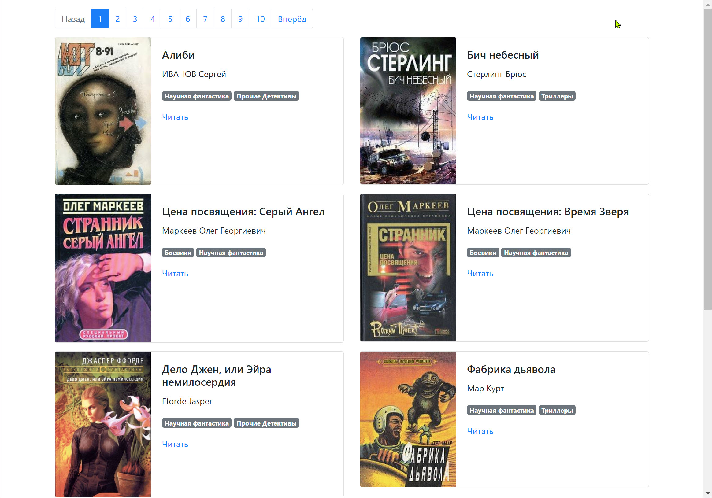

# Парсер онлайн-библиотеки

Скрипт умеет парсить сайт онлайн [библиотеки](https://tululu.org/). Собирает информацию о книгах и может скачать книги и изображения к ним 
в формате txt, а также создаёт на их основе оффлайн-сайт.

Пример готового сайта можно увидеть [здесь](https://alexnv.github.io/09-online-library-parser/pages/index1.html).




## Оффлайн-сайт с библиотекой

Для того, чтобы сохранить сайт на свой компьютер, потребуется скачать из репозитория все папки (`books`, `pages`, `static`) и файл `index.html`, который затем нужно будет запустить с помощью браузера.


## Установка

Должен быть установлен python3.

Затем используйте pip (или pip3, если есть конфликт с python2) для установки зависимостей:

```
pip install -r requirements.txt
```

или

```
pip3 install -r requirements.txt
```

Рекомендуется использовать virtualenv / venv для изоляции проекта.

## Скрипт скачивания книг по их id

Запустите скрипт командой:
```
python main.py 
```
Скрипт скачает книги и изображения к ним, которые после можно будет найти в папке `books` 
соответственно, а также появится файл `books.json` с информацией о книгах. 

Скрипт имеет следующие аргументы для более "умного" парсинга:

- `-s (--start_id)` и `-e (--end_id)`: Они определяют начальный и конечный id книг для скачивания.

Пример запуска скрипта с аргументами:
```
python library_parser.py -s 700 -e 710 
```

Приведенная выше команда скачает книги начиная со страниц 700 по 710 в папку `books`

## Скрипт для скачивания категории книг

Находясь в директории проекта, откройте с помощью python3 файл `parse_tululu_category.py`

```
python parse_tululu_category.py
```
По умолчанию, в директории проекта будет создан файл `books_descriptions.json` с данными о книгах, а также папки `books` и `images`, в которые будут скачаны тексты книг и обложки из категории `Научная фантастика`.

Доступен ряд аргументов, и все они являются необязательными.

Для того чтобы увидеть меню со справкой об аргументах, запустите скрипт с аргументом `-h` или `--help`:

```
python parse_tululu_category.py -h
```

```
python parse_tululu_category.py --help
```

В результате в консоль выведется следующее:

```
usage: parse_tululu_category.py [-h] [-g GENRE] [-s START_PAGE] [-e END_PAGE] [-f DEST_FOLDER] [-i] [-t] [-j JSON_PATH]

Все представленные аргументы являются опциональными. По умолчанию будут скачаны все книги и картинки со всех доступных страниц в заранее
определённые папки в корневом каталоге проекта.

options:
  -h, --help            show this help message and exit
  -g GENRE, --genre GENRE
                        Введите номер жанра. По умолчанию будет указан номер 55, что соответствует жанру "Научная фантастика".
  -s START_PAGE, --start_page START_PAGE
                        Введите номер начальной страницы. Если не вводить номер конечной страницы, будут скачаны все доступные страницы с
                        начальной включительно.
  -e END_PAGE, --end_page END_PAGE
                        Введите номер конечной страницы. Если не вводить номер начальной страницы, будут скачаны все доступные страницы с
                        первой по конечную включительно.
  -f DEST_FOLDER, --dest_folder DEST_FOLDER
                        Введите путь к каталогу с результатами парсинга: картинкам, книгам, JSON.
  -i, --skip_imgs       По умолчанию картинки будут скачаны. Для отмены укажите при запуске аргумент без значения.
  -t, --skip_txt        По умолчанию тексты книг будут скачаны. Для отмены укажите при запуске аргумент без значения.
  -j JSON_PATH, --json_path JSON_PATH
                        Введите путь к *.json файлу с результатами.
```

## Скрипт создания локальной копии сайта на основании скачанных книг
Данный скрипт собирает из скачанных книг, обложек и прочих метаданных локальный сайт, а также создаёт и запускает локальный сервер. 
Перед запуском необходимо выполнить шаги раздела Установка и скачать книги  

```
python render_website.py
```

Страницы сайта формируются на основе шаблона `template.jinja2` и обновляются без перезагрузки при любом изменении шаблона.

Стартовая страница будет доступна по адресу:

```
127.0.0.1:5500/pages/index1.html
```

Для того чтобы увидеть меню со справкой об аргументах, запустите скрипт с аргументом `-h` или `--help`:

```
python render_website.py -h
```

```
python render_website.py --help
```

В результате в консоль выведется следующее:


```commandline
usage: render_website.py [-h] [-f BOOK_FOLDER] [-j JSON_PATH] [-o OUTPUT_PATH] [-p BOOKS_PER_PAGE]                                                                                      
                                                                                                                                                                                        
Все представленные аргументы являются опциональными. По умолчанию будут скачаны все книги и картинки со всех доступных страниц в заранее определённые папки в корневом каталоге проекта.
                                                                                                                                                                                        
optional arguments:                                                                                                                                                                     
  -h, --help            show this help message and exit                                                                                                                                 
  -f BOOK_FOLDER, --book_folder BOOK_FOLDER                                                                                                                                             
                        Введите путь к каталогу с результатами парсинга: картинкам, книгам, JSON.                                                                                       
  -j JSON_PATH, --json_path JSON_PATH                                                                                                                                                   
                        Введите путь к *.json файлу с результатами.
  -o OUTPUT_PATH, --output_path OUTPUT_PATH
                        Введите путь к каталогу со сгенерированными страницами сайта
  -p BOOKS_PER_PAGE, --books_per_page BOOKS_PER_PAGE
                        Количество книг на странице

```

## Цель проекта

Код написан в образовательных целях на онлайн-курсе для веб-разработчиков https://dvmn.org/.